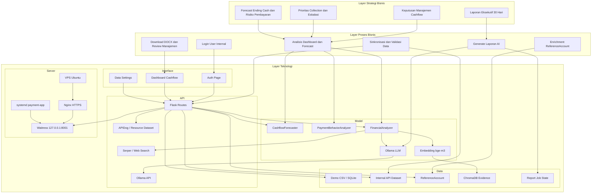
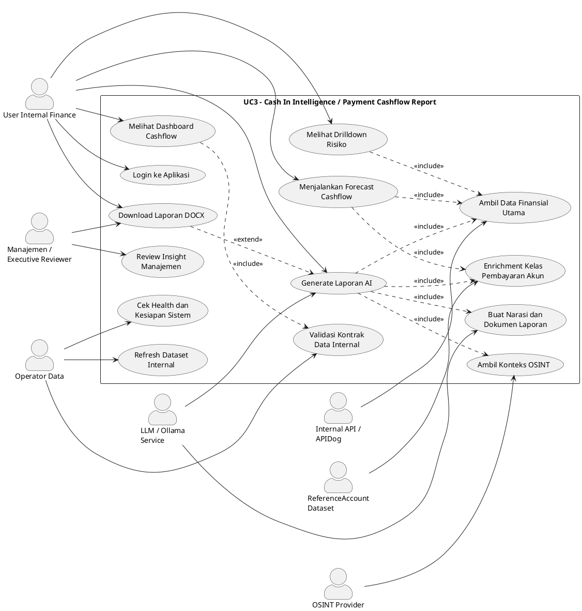

# Handover Arsitektur Sistem AI dan Use Case Model

Dokumen ini menjelaskan arsitektur sistem AI untuk use case **Cash In Intelligence / Payment Cashflow Report UC3**. Scope arsitektur dibatasi pada konteks use case aplikasi, bukan arsitektur organisasi Inixindo secara luas.

## 1. Arsitektur Sistem AI Berdasarkan Layer TOGAF

### 1.1 Ringkasan Sistem

Sistem UC3 adalah aplikasi web internal untuk membantu tim Finance dan manajemen membaca kondisi cash in, risiko pembayaran, proyeksi cashflow, serta menghasilkan laporan manajemen berbasis AI. Sistem menggabungkan data invoice, kelas pembayaran, referensi akun, konteks cash out, OSINT, model forecast deterministik, embedding, dan LLM untuk menghasilkan dashboard serta dokumen analisis.

### 1.2 Layer Strategi Bisnis

Layer ini menjelaskan alasan bisnis dari use case.

| Elemen | Penjelasan |
|---|---|
| Tujuan bisnis | Membantu manajemen memahami kondisi cashflow, risiko keterlambatan pembayaran, prioritas penagihan, dan implikasi bisnis jangka pendek sampai jangka menengah. |
| Sasaran pengguna | Tim Finance, manajemen, dan operator internal yang perlu membaca kondisi cash in/cash out secara cepat dan membuat laporan eksekutif. |
| Nilai utama | Mengubah data invoice dan perilaku pembayaran menjadi insight deskriptif, diagnostik, prediktif, dan preskriptif. |
| Keputusan yang didukung | Prioritas collection, eskalasi akun berisiko, pengelolaan buffer kas, proyeksi ending cash, dan rekomendasi 30 hari. |
| Prinsip bisnis | Data internal menjadi sumber kebenaran utama; OSINT hanya sebagai konteks pendukung; mode data tidak diekspos ke user akhir. |
| Output bisnis | Dashboard cashflow, forecast per horizon, drilldown risiko, dan dokumen laporan manajemen berbentuk DOCX. |

### 1.3 Layer Proses Bisnis

Layer ini menjelaskan proses kerja aplikasi dalam konteks use case.

| Proses | Aktor Utama | Output |
|---|---|---|
| Login dan akses aplikasi | User internal | Sesi aplikasi yang tervalidasi. |
| Sinkronisasi data finansial | Operator data / sistem | Dataset aktif yang siap dianalisis. |
| Validasi kontrak data internal | Operator data / sistem | Status kesiapan field wajib: periode, partner, layanan, kelas pembayaran, nilai invoice. |
| Enrichment referensi akun | Sistem | Kelas pembayaran dari `ReferenceAccount` digunakan untuk melengkapi invoice yang memiliki `company_id` atau nama akun cocok. |
| Analisis dashboard | User internal | Ringkasan cashflow, outstanding, risiko konsentrasi, dan status operasional. |
| Forecast cashflow | User internal / sistem | Proyeksi cash in, cash out, ending cash, dan payment behavior per horizon. |
| Drilldown risiko | User internal | Detail top overdue, tren kelas pembayaran, konsentrasi partner/layanan. |
| Generate laporan AI | User internal | Job laporan antrean server dan file DOCX. |
| Monitoring kesiapan | Operator / sistem | Health check, status sync, status job queue, dan kesiapan kontrak data. |

### 1.4 Layer Teknologi

Layer ini menjelaskan komponen teknologi yang mendukung interface, model, data, API, dan server.

#### A. Interface

| Komponen | Fungsi |
|---|---|
| `templates/auth.html` | Login dan signup user internal. |
| `templates/index.html` | Dashboard utama untuk forecast, drilldown, insight, dan generate report. |
| `templates/data_settings.html` | Halaman status koneksi data internal dan refresh dataset, tanpa mengekspos mode data ke user umum. |
| Route Flask | Menghubungkan UI dengan service backend seperti report, forecast, auth, data source, dan health. |

#### B. Model

| Komponen | Fungsi |
|---|---|
| `CashflowForecaster` | Model deterministik untuk proyeksi cash in, cash out, ending cash, dan risk signal. |
| `PaymentBehaviorAnalyzer` | Mapping kelas pembayaran A-E menjadi estimasi delay, retention, satisfaction, dan bucket risiko. |
| `FinancialAnalyzer` | Menyusun konteks analisis, metrik, evidence, readiness, dan narasi bisnis. |
| `CashflowIntelligenceDesk` | Quality-control tersembunyi untuk memperkuat akurasi laporan tanpa menampilkan label workflow ke user. |
| Ollama LLM | Menulis laporan manajemen berdasarkan konteks terstruktur. |
| Ollama Embedding `bge-m3` | Membuat embedding catatan internal untuk retrieval evidence. |

#### C. Data

| Sumber Data | Peran |
|---|---|
| Demo CSV `data/db.csv` | Dataset fallback dan smoke test lokal/server. |
| SQLite finance DB | Menyimpan dataset aktif yang sudah dinormalisasi. |
| Internal API / APIDog | Sumber produksi untuk dataset finansial ketika tersedia. |
| `ReferenceAccount` | Sumber referensi akun untuk enrichment kelas pembayaran berdasarkan `company_id` atau nama akun. |
| Cash-out API opsional | Sumber jadwal pengeluaran jika dikonfigurasi. |
| ChromaDB | Penyimpanan embedding untuk retrieval evidence internal. |
| SQLite job state | Menyimpan status job generate laporan. |
| Generated reports directory | Menyimpan file DOCX hasil generate. |

Catatan data penting:

- `ReferenceAccount` bukan pengganti dataset invoice utama.
- `ReferenceAccount` dipakai sebagai referensi untuk melengkapi kelas pembayaran ketika invoice utama punya identitas akun yang bisa dicocokkan.
- Forecast penuh tetap membutuhkan data finansial utama seperti periode, layanan, nilai invoice, dan kelas pembayaran.

#### D. API

| API / Endpoint | Fungsi |
|---|---|
| `GET /health` | Mengecek kesehatan aplikasi, job queue, kesiapan data, auth security, dan sync status. |
| `GET /get-config` | Mengambil konfigurasi dashboard dan konteks review. |
| `POST /api/forecast` | Menghasilkan forecast untuk periode custom. |
| `POST /api/forecast/by-horizon` | Menghasilkan forecast short, mid, dan long term. |
| `GET /api/forecast/outstanding` | Menganalisis outstanding berdasarkan karakter pembayaran. |
| `POST /api/forecast/drilldown/top-overdue` | Mengambil drilldown akun/segmen overdue. |
| `GET /api/forecast/drilldown/payment-class-trend` | Mengambil tren kelas pembayaran. |
| `POST /generate` | Membuat job laporan AI. |
| `GET /jobs/{job_id}` | Melihat status job laporan. |
| `GET /jobs/{job_id}/download` | Mengunduh laporan DOCX. |
| `GET /api/internal-data/contract` | Melihat kontrak data internal dan kesiapan field. |
| `POST /api/internal-api/refresh` | Refresh dataset internal aktif. |
| Internal APIDog `/api/Resource/dataset` | Endpoint eksternal untuk mengambil dataset seperti `ReferenceAccount` dan dataset finansial lain. |
| Serper / Ollama Web Search | Konteks OSINT pendukung untuk laporan. |

#### E. Server

| Komponen Server | Fungsi |
|---|---|
| VPS Ubuntu | Host aplikasi UC3. |
| `payment-app.service` | Systemd service untuk menjalankan aplikasi. |
| Waitress | WSGI server aplikasi Flask pada `127.0.0.1:8001`. |
| Nginx | Reverse proxy HTTPS ke aplikasi. |
| Ollama service | Menyediakan LLM dan embedding model lokal/server. |
| Environment files | Menyimpan konfigurasi runtime dan kredensial API di sisi server. |
| Generated files | Report DOCX dan state job disimpan di disk server. |

### 1.5 Diagram Arsitektur Layer TOGAF

## 2. Use Case Model UML

### 2.1 Aktor

| Aktor | Deskripsi |
|---|---|
| User Internal Finance | Pengguna utama yang membaca dashboard, menjalankan forecast, dan membuat laporan. |
| Manajemen / Executive Reviewer | Penerima hasil laporan dan insight untuk pengambilan keputusan. |
| Operator Data | Pihak yang memastikan koneksi data internal, refresh dataset, dan kesiapan kontrak data. |
| Internal API / APIDog | Sistem eksternal penyedia dataset internal. |
| ReferenceAccount Dataset | Dataset referensi akun untuk enrichment kelas pembayaran. |
| LLM / Ollama Service | Sistem model AI untuk laporan dan embedding. |
| OSINT Provider | Sumber konteks eksternal untuk sinyal pendukung. |

### 2.2 Diagram Use Case UML

### 2.3 Deskripsi Use Case Utama

| Use Case | Aktor | Tujuan | Alur Ringkas |
|---|---|---|---|
| Login ke Aplikasi | User Internal Finance | Membatasi akses hanya untuk user internal yang valid. | User login, sistem validasi credential, sistem membuat session. |
| Melihat Dashboard Cashflow | User Internal Finance | Membaca status cashflow, outstanding, risiko, dan rekomendasi ringkas. | User membuka dashboard, sistem mengambil data aktif, sistem menampilkan ringkasan. |
| Menjalankan Forecast Cashflow | User Internal Finance | Menghasilkan proyeksi cash in, cash out, ending cash, dan risiko per horizon. | User memilih input cash position/periode, sistem menghitung forecast, sistem menampilkan hasil. |
| Melihat Drilldown Risiko | User Internal Finance | Mendalami akun/segmen/kelas pembayaran yang paling berisiko. | User membuka drilldown, sistem menghitung konsentrasi dan overdue, sistem menampilkan daftar prioritas. |
| Refresh Dataset Internal | Operator Data | Mengambil ulang data dari sumber aktif. | Operator menekan refresh, sistem fetch data, normalisasi, enrichment, dan update status. |
| Validasi Kontrak Data Internal | Operator Data | Memastikan dataset memenuhi field minimum untuk analisis. | Sistem membaca schema, cek field wajib, dan menampilkan status kesiapan. |
| Enrichment Kelas Pembayaran Akun | Sistem / ReferenceAccount | Melengkapi kelas pembayaran pada invoice berdasarkan referensi akun. | Sistem membaca `ReferenceAccount`, cocokkan `company_id`/nama akun, mapping `Tipe A-D` ke `Kelas A-D`. |
| Generate Laporan AI | User Internal Finance | Membuat laporan manajemen berbasis AI. | User mengisi fokus analisis, sistem membuat job, mengambil konteks data, OSINT, LLM, lalu membuat DOCX. |
| Download Laporan DOCX | User Internal Finance / Manajemen | Mengambil file laporan siap review. | User membuka status job, jika selesai sistem menyediakan file DOCX. |
| Cek Health dan Kesiapan Sistem | Operator Data | Memastikan service, data, auth, dan job queue siap. | Operator membuka health/status, sistem mengembalikan status runtime dan readiness. |

### 2.4 Batasan Use Case

1. `ReferenceAccount` dipakai sebagai data referensi, bukan dataset finansial utama.
2. Forecast penuh tetap membutuhkan dataset utama yang memiliki nilai invoice, periode, layanan, dan identitas pembayaran.
3. OSINT tidak menjadi sumber kebenaran angka internal; OSINT hanya memperkaya konteks eksternal.
4. Mode data dan detail konfigurasi produksi tidak ditampilkan sebagai pilihan user-facing.
5. Laporan AI harus tetap menggunakan konteks internal yang sudah divalidasi agar tidak membuat klaim tanpa basis data.
